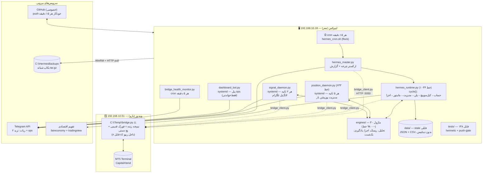

# Hermes Trading — گزارش فاز صفر: شناخت کامل سیستم فعلی
**تاریخ:** ۲۰۲۶-۰۹-۱۸ | **مبنا:** کامیت `d21ab9e` (شاخه `arena/01a0b335-hermes-trading`)
**روش:** خوانش مستقیم ~۱۱۴٬۰۰۰ خط کد پایتون، ۲۱۳ اسکریپت، ۱۳۸ فایل تست، ۳۰+ موتور، کانفیگ‌های systemd/cron، و نمونه state زنده. هیچ تغییری در منطق معاملاتی داده نشده است.

---

## ۱. تصویر یک‌خطی

Hermes یک **سیستم ترید خودکار XAUUSD، صددرصد بدون تأیید انسانی** است با معماری درستِ «مغز روی لینوکس + بازوی اجرا (MT5) روی ویندوز» که از طریق **بریج HTTP روی پورت ۵۰۵۰** به هم وصل می‌شوند. سیستم دو پروژه جدا دارد: (۱) تریدر خودکار اسکنر-محور، (۲) شنونده سیگنال تلگرام. چیزی که امروز «هوش» نامیده می‌شود، **تحلیل تکنیکال قانون‌محور (SMC + کلاسیک) + گیت‌های ریسک fail-closed + یادگیری تطبیقیِ فقط-سفت‌کننده** است — نه مدل ML آموزش‌دیده.

---

## ۲. معماری فعلی (وضع موجود واقعی، نه ایده‌آل)

### ۲.۱ دیاگرام ارتباط اجزا



### ۲.۲ جریان داده هر پروژه

**پروژه ۱ — تریدر خودکار (اسکن → پلن → ورود → مدیریت):**
```
cron(15m) → hermes_master.main()
  → BridgeClient.health() → قطع = هشدار ops و خروج
  → hermes_runtime.cycle(bridge, dry_run):
      ۱. get_account / get_tick / get_positions
      ۲. risk.assess_account_policy + compute_performance_state
      ۳. kill_switch.check → halted = فقط مدیریت حفاظتی (b207)، بدون ورود جدید
      ۴. route_runtime_step → plan/reassess → build_live_plan:
           OHLC (M5/H1/H4) → context.build_plan_context (ATR، بایاس، زون‌ها، رژیم)
           → smc.smc_analyse (OB/FVG/Sweep/ساختار/POI/killzone)
           → merge_smc_with_classic → macro_snapshot (DXY/نقره/HTF)
           → orchestrator.build_plan_from_context → ذخیره current_plan.json
      ۵. اگر واچ‌داگ زنده نیست: _manage_positions_fallback (news_lock/time_exit/TP1/BE/trail)
      ۶. evaluate_monitor_cycle (تریگر ورود + تأیید M5 با ساعت بروکر، b187/b79)
      ۷. macro_filter (بلک‌اوت خبر ۳۰ دقیقه، fail-closed) → auto_executor.evaluate_proposal
           (۸+ چک: پروپوزال، حساب، ضرر روزانه، تعداد ترید، سقف پوزیشن=۱، هندسه، RR≥۱.۵، سشن، گرید…)
         → execute_trade → bridge.send_order
  → learning.run_learning_cycle (journal از deals واقعی → analyze → apply فقط-سفت‌کننده)
  → build_report → تلگرام + logs/report.txt
position_daemon (هر ۵s، مستقل): ترک پوزیشن‌ها، MFE/MAE، تشخیص SL/TP جابه‌جا شده،
  manage_position (مدیریت فرکانس‌بالا + news_lock/time_exit)، heartbeat، گزارش باز/بسته شدن
```

**پروژه ۲ — سیگنال تلگرام (دریافت → ارزیابی → اجرا/رد/pending):**
```
signal_daemon (حلقه ۲ ثانیه) → signal_listener.run_signal_check:
  getUpdates تلگرام → is_likely_signal → signal_parser (فارسی/انگلیسی/ایموجی/اعداد فارسی/TP پلکانی)
  → check_signals: لود پلن جاری Hermes → signal_decision.evaluate_signal (۷ چک):
      نماد=XAUUSD، اعتماد پارسر، جهت معتبر، **هم‌راستایی با بایاس Hermes**، RR، سیاست حساب، ماکرو/سشن
    → verdict: execute | limit_pending (اردر pending اگر قیمت نرسیده، b70) | skip (با دلیل)
  → اجرا: bridge.send_order / send_pending (⚠️ روی بریج v2 ریپو وجود ندارد — بخش ۶)
  → signal_pending.watch_pending: آشتی LIMITهای پارک‌شده (فیل/اکسپایر/کنسل)
```

---

## ۳. تکنولوژی‌ها و وابستگی‌ها

| لایه | تکنولوژی | توضیح |
|---|---|---|
| زبان | Python 3.11+ | بدون فریم‌ورک؛ stdlib + چند کتابخانه |
| وابستگی‌ها | requests, python-dotenv (+env_loader فالبک)، pandas، numpy، python-telegram-bot، pywinrm، requests_ntlm | نصب در `setup.sh` |
| بریج MT5 | Flask + `MetaTrader5` (کتابخانه ویندوزی) | ⚠️ نسخه ریپو: Flask dev-server، بدون احراز هویت |
| ارتباط لینوکس↔ویندوز | HTTP/REST روی `:5050` + WinRM (دیپلوی/بکاپ) | توکن Bearer در کلاینت؛ سرور ریپو آن را چک نمی‌کند |
| زمان‌بندی | cron (۶ جاب) + systemd user services (۳ سرویس) | مستند در `ops/cron` و `ops/systemd` |
| state | فایل: JSON + CSV در `data/` | بدون دیتابیس؛ atomic-write دستی |
| تقویم خبر | faireconomy JSON + TradingView economic-calendar | رایگان، ناپایدار، fail-closed |
| اعلان | Telegram Bot API (۲ ربات: ترید + ops) | مسیریابی در `notifier/telegram.py` |
| CI/تست | unittest + hermetic + `verify_head.sh` + push-gate | ۱۳۸ فایل تست، الگوی `HERMES_DATA_ROOT` |
| بکاپ | tar.gz شبانه → ویندوز + `repo.bundle` + گیت‌هاب | نگه‌داشت ۱۴ نسخه |
| بک‌تست | `engines/backtest.py` + `backtest_real.py` + ~۱۰۰ اسکریپت lab سری b | پروتکل A/B چند-پنجره‌ای (b68) |

**حجم ریپو (وضع فعلی):** ~۱۰۴MB شامل `data/xau_plan/plan_history` حدود ۳۵MB (۱۵۹۴ فایل)، `data/backtest` حدود ۲۴MB، `legacy_backup` حدود ۳۰MB.

---

## ۴. نقشه فایل‌ها و سرویس‌ها (هر جزء چه می‌کند)

### ۴.۱ نقطه‌های ورود (ریشه)

| فایل | نقش | اجرا توسط |
|---|---|---|
| `hermes_master.py` | ارکستر چرخه ۱۵ دقیقه‌ای: هلث بریج → `cycle()` → یادگیری → گزارش تلگرام؛ هشدار گاردهای تضعیف‌شده (b37) | cron |
| `hermes_runtime.py` | هسته مشترک چرخه: پلن‌سازی زنده، مدیریت fallback، مانیتور ورود، اجرای پروپوزال | master |
| `position_daemon.py` | واچ‌داگ ۵ ثانیه‌ای پوزیشن‌ها + مدیریت فرکانس‌بالا + کالیبراسیون ساعت بروکر + heartbeat | systemd |
| `signal_daemon.py` | حلقه ۲ ثانیه‌ای تلگرام + آشتی pendingها + گزارش لحظه‌ای | systemd |
| `signal_monitor.py` | wrapper تکی `run_signal_check` برای اجرای دستی/کرون | دستی |
| `bridge_client.py` | تنها کلاینت HTTP بریج (health/account/tick/positions/rates/deals/order/close/partial/modify/pending/cancel) | همه |
| `backtest_runner.py` | CLI بک‌تست واقعی با دیتای بریج | دستی |
| `cli.py` | CLI مدیریتی (`status/report/plan/run`) | دستی |
| `env_loader.py` | فالبک لود `.env` وقتی python-dotenv نیست | همه |
| `setup.sh` | نصب یک‌ضرب سرور تازه (deps، سرویس‌ها، کرون، تست) | دستی |

### ۴.۲ موتورها (`engines/` — ۳۰ ماژول)

| گروه | ماژول‌ها | وظیفه |
|---|---|---|
| تحلیل | `context` (ATR/بایاس/زون/رژیم)، `smc` (۹۵۶ خط: OB/FVG/sweep/ساختار/premium-discount/killzone/POI/breaker/OTE/PO3/turtle-soup/silver-bullet)، `macro_snapshot` (پراکسی DXY از ۶ جفت + نقره + HTF)، `broker_clock` (کالیبراسیون ساعت بروکر)، `economic_calendar` | ورودی تصمیم |
| پلن/تصمیم | `orchestrator` (route/build/monitor/sizing)، `plan` (گرید ستاپ A/B/C، بلوبریند خرید/فروش، reanchor)، `signal_decision` (۷ چک امتیازی)، `signal_parser` (۵۳۴ خط: چندزبانه)، `signal_listener` (۷۲۳ خط: پول تلگرام + ارزیابی)، `signal_pending` (پارک LIMIT + watch) | مغز تصمیم |
| ریسک/ایمنی | `risk` (سیاست حساب/پرفورمنس)، `defcon` (تحلیل exits)، `cooldown` (استارتاپ/بازگشایی)، `kill_switch` (۵٪ روزانه/۱۰٪ اکوییتی/۴ ضرر متوالی/مارجین → توقف ۴ ساعته)، `macro_filter` (بلک‌اوت ۳۰د fail-closed)، `market_hours` (Sun23→Fri22 UTC)، `legacy_guards` (news_lock/time_exit)، `guard_status` (خوانش یکتا)، `dirty_work`، `selfcheck`، `head_verify` | تورهای نجات |
| اجرا | `auto_executor` (۵۶۷ خط: ۸+ گیت + سایزینگ + execute)، `trade_management` (TP پلکانی/BE/partial/trail/scale-in)، `bridge_payload` (خوانش امن پاسخ پوزیشن‌ها) | دست‌ها |
| یادگیری | `learning` (۵۲۸ خط: journal→analyze→adjust→apply، فقط-سفت‌کننده)، `lab_harness/lab_decay/lab_fire_rate` (پروتکل تحقیق) | حافظه |
| بک‌تست | `backtest` (موتور OHLC با RR/گرید/BE/partial/trail/time-stop)، `backtest_real` (واکشی از بریج + اجرا) | آزمایشگاه |
| زیرساخت | `paths` (ریشه دیتا + atomic IO)، `storage` (پلن/ژورنال/ledger)، `report` (رندر فارسی)، `autopilot_report_lib` | ستون فقرات |

### ۴.۳ سرویس‌ها و کرون

| جزء | زمان‌بندی | کار |
|---|---|---|
| `hermes-position.service` | همیشه (۵s حلقه) | مدیریت پوزیشن |
| `hermes-signal.service` | همیشه (۲s حلقه) | شنونده سیگنال |
| `hermes-dashboard.service` | همیشه (پول) | پنل ops فقط‌خواندنی (۱۴۶۷ خط در `notifier/dashboards.py`) |
| `hermes_cron.sh` | `*/15` | چرخه master |
| `bridge_health_monitor.py` | `*/5` | ۳ خطای متوالی = آلارم؛ ریکاوری = اطلاع |
| `autopilot.sh` + `autopilot_digest.py` | ساعتی + ۰۲:۰۰ | ایجنت کدنویس شبانه (read-only معاملاتی) + دایجست |
| `offsite_backup.py` | ۲۳:۴۵ UTC | tar.gz کامل → ویندوز |
| `git_sync.sh` | `*/15` | push با push-gate (فقط HEAD تأییدشده) |
| `weekly_report.py` | جمعه ۲۲:۳۰ | گزارش مدیریتی فارسی |

### ۴.۴ داده (`data/`)

| مسیر | محتوا |
|---|---|
| `xau_plan/` | پلن جاری، هیستوری پلن‌ها (۱۵۹۴ فایل)، ژورنال CSV، ledger ریسک، learning_state، performance، heartbeat واچ‌داگ، کالیبراسیون ساعت |
| `backtest/` | ~۱۵۰ خروجی A/B و sweep (سری b) |
| `signals/` | لاگ سیگنال‌ها + pendingها |
| `calendar/` | کش تقویم + آرشیو واقعی رویدادها (b132) |
| `ops/` | بک‌لاگ اتوپایلوت (۴۸۰۴ خط: ۴۵ todo / ۱۲۰ done)، stateها، مهر head_verified |
| `radin/` | تاریخچه کانال رادین (۷ فایل jsonl + replay CSV) — دیتای پروژه ۲ |
| `trading/` | آخرین ریپورت |

### ۴.۵ بکاپ‌ها و آرشیوها

| مورد | وضعیت |
|---|---|
| `backups/pre_restructure_20260828_113202.tar.gz` (۳۴۹KB) | اسنپ‌شات کد پیش از ری‌استراکچر؛ **state زنده نیست** |
| `legacy_backup/` (۳۰MB: zip + extracted + normalized) | آرشیو نسخه‌های قدیمی (کد + ساختار قدیمی `master/apprentice/shared`) |
| `legacy_removed/` (۴۲۸KB) | ماژول‌های حذف‌شده (`hermes_brain/master_trader/orchestrator/analyzer/adapter`) + اسکریپت‌های قدیمی |
| `C:\HermesBackups` (روی ویندوز، خارج ریپو) | بکاپ واقعی عملیاتی: `data/` + `.env` + `.git_token` + `repo.bundle` — **در این بررسی قابل رؤیت نبود** |

---

## ۵. وضعیت فعلی: تکمیل‌شده / ناقص

### ✅ تکمیل‌شده (قابل اتکا)
- چرخه خودکار سرتاسری (plan→monitor→execute→manage→report) با DRY_RUN پیش‌فرض امن
- مدیریت دو‌لایه پوزیشن (واچ‌داگ ۵ ثانیه‌ای + fallback داخل runtime با handoff مبتنی بر heartbeat)
- تور ایمنی چندلایه و عمدتاً fail-closed: kill-switch، بلک‌اوت خبر، ساعت بازار، cooldown، DEFCON، RR≥۱.۵، سقف ۱ پوزیشن
- مسیر سیگنال تلگرام با پارسر چندزبانه قوی و **مقایسه با بایاس خودی (نه اجرای کور)** + LIMIT pending + آشتی
- ژورنال‌گیری از deals واقعی بروکر + یادگیری تطبیقی محافظه‌کار (فقط سفت‌کننده، هرگز شل‌کننده)
- بک‌تست واقعی + فرهنگ A/B چند-پنجره‌ای با پروتکل ضد-فریب (b68/b74/b77/b79)
- تست hermetic مکان-مستقل + تأیید HEAD در worktree تمیز + push-gate (استاندارد بالاتر از معمول پروژه‌های شخصی)
- بکاپ آف‌باکس + بازیابی مستند (`docs/DEPLOY.md` واقعاً قابل اجراست) + `setup.sh` idempotent
- کالیبراسیون ساعت بروکر (UTC+3) و انتشار آن بین دایمون و runtime

### 🟡 ناقص / نیمه‌کاره
- **pending روی بریج:** کلاینت `/api/pending` و `/api/cancel` را صدا می‌زند ولی فایل `mt5_http_server_v2.py` داخل ریپو این endpointها را **ندارد** (روی بریج زنده با اسکریپت جدا پچ شده — یعنی سورس زنده ≠ ریپو)
- **احراز هویت بریج:** نسخه ریپو هیچ چک توکنی ندارد؛ زنده (طبق کامنت `_deploy_bridge.py`) توکن+waitress دارد ولی سورسش در ریپو نیست
- **ML واقعی:** هیچ مدل آموزشی/استنتاجی وجود ندارد؛ «یادگیری» = قواعد تطبیقی روی ژورنال
- **چندنمادی:** همه‌چیز XAUUSD-محور و در چندین لایه هاردکد؛ سیگنال غیرطلا skip می‌شود
- **فاندامنتال:** فقط بلک‌اوت خبر + پراکسی DXY؛ تحلیل فاندامنتال واقعی (نرخ بهره، CPI، سنتیمنت) نیست
- **قابلیت مشاهده:** فقط لاگ فایل + تلگرام؛ بدون متریک/داشبورد سری‌زمانی/هشدار سطح‌بندی‌شده

---

## ۶. مشکلات موجود (اولویت‌بندی‌شده با شدت)

| # | شدت | مشکل | شاهد | اثر |
|---|---|---|---|---|
| ۱ | 🔴 بحرانی | **بریج زنده ≠ بریج ریپو (drift):** زنده `C:\Temp\bridge.py` فورک قدیمی + پچ دستی است؛ ریپو فقط مرجع است. بازتولید محیط اجرا از روی گیت ممکن نیست | `_deploy_bridge.py`، نبود auth در `mt5_http_server_v2.py` | ریسک بازسازی، دیباگ غیرممکن، `/api/pending` معلق |
| ۲ | 🔴 بحرانی | **بدون احراز هویت در سورس ریپو:** هرکس در LAN به `:5050` برسد می‌تواند order/close/modify بزند | grep روی سرور: صفر خط auth | اگر بریج زنده هم روزی بدون توکن بالا بیاید = اجرای بیگانه |
| ۳ | 🔴 مهم | **`data/` داخل گیت (۱۷۸۷ فایل، ~۶۰MB):** خلاف ادعای docs («فقط در بکاپ، نه در گیت») | `git ls-files \| grep data` | کلون سنگین، کانفلیکت state، لو رفتن state معاملاتی در تاریخچه |
| ۴ | 🟠 مهم | **بکاپ روی HTTP متن‌باز:** `.env` و توکن‌ها با `http://` روی LAN منتقل می‌شوند + WinRM با `server_cert_validation='ignore'` | `offsite_backup.py:102` | شنود توکن‌ها در شبکه داخلی |
| ۵ | 🟠 مهم | **state فایلی بدون DB:** ۴ نویسنده هم‌زمان (کرون + ۳ دایمون) روی JSON/CSV؛ بدون تراکنش | `paths.write_json_atomic` (فقط atomic، نه transactional) | ریسک خرابی/نیمه‌نوشته شدن تحت خطا؛ رشد plan_history بی‌سقف واقعی |
| ۶ | 🟠 مهم | **تک‌نمادی هاردکد:** XAUUSD در runtime/دایمون/کلاینت/تست‌ها پخش است | `SYMBOL`، `check_signals`، `evaluate_signal` | توسعه به فارکس چندجفتی = ریفکتور گسترده |
| ۷ | 🟡 متوسط | **سوئیت تست کند/سنگین:** در سندباکس تمیز >۳ دقیقه (وابستگی `requests` هم نصب نبود) | اجرای واقعی | اصطکاک CI و اعتبارسنجی سریع |
| ۸ | 🟡 متوسط | **۲۱۳ اسکریپت بدون ایندکس:** اکثراً پروب‌های یک‌بارمصرف سری b | `ls scripts` | هزینه نگهداشت و سردرگمی اپراتور |
| ۹ | 🟡 متوسط | **تقویم شکننده:** ۲ سورس رایگان (یکی شکست‌خورده در ۲/۴ تست)؛ خرابی = توقف ورود (امن ولی فلج‌کننده) | `economic_calendar.py` + b30 | روزهای بدون تقویم = بدون ترید |
| ۱۰ | 🟡 متوسط | **پولینگ به‌جای استریم:** تیک ۵ ثانیه‌ای، سیگنال ۲ ثانیه‌ای، پلن ۱۵ دقیقه‌ای | دایمون‌ها | برای M5/H1 کافی؛ برای اسکلپ M1/خبر دیر است |
| ۱۱ | 🟡 متوسط | **پیش‌فرض‌های بروکر/ساعت:** CapitalXtend، UTC+3، chat-id مالک در کد | چندین فایل | جابه‌جایی بروکر/سرور = شکار دستی مقادیر |
| ۱۲ | 🟢 کم | **تاریخچه گیت در این کلون:** shallow تک‌کامیت؛ روند و بدهی تاریخی قابل ممیزی نیست | `git log --oneline \| wc -l` → ۱ | نیاز به کلون کامل برای ممیزی تاریخچه |

**نکته امنیتی مثبت:** هیچ سکرتی (توکن/پسورد واقعی) در فایل‌های ترک‌شده گیت پیدا نشد؛ `.env` و `.git_token` در `.gitignore` هستند.

---

## ۷. تحلیل مرحله دوم: آیا این معماری برای «ربات ترید حرفه‌ای» مناسب است؟

| سؤال | پاسخ کوتاه | شرح |
|---|---|---|
| قابلیت توسعه؟ | 🟡 مشروط | موتورها ماژولار و تست‌پذیرند، ولی تک‌نمادی بودن، state فایلی، و drift بریج سه سقف توسعه‌اند. با رفع این سه، بله. |
| مقیاس‌پذیری؟ | 🔴 عمودی خیر، افقی خیر | تک‌باکس، تک‌سیمبل، تک‌پوزیشن، بدون صف/DB. برای «یک استراتژی روی طلا» کافی است؛ برای پورتفوی/چندجفت/فرکانس‌بالا باید بازطراحی شود. |
| امنیت کافی؟ | 🟡 نزدیک، نه کافی | گیت‌های معاملاتی عالی‌اند؛ امنیت زیرساخت (auth بریج، TLS، بکاپ، سکرت) ناقص است. |
| اتصال به متاتریدر مناسب است؟ | 🟡 کار می‌کند ولی حرفه‌ای نیست | REST polling جواب می‌دهد؛ ولی نسخه canonical ندارد، idempotency ندارد، reconnect/backoff هوشمند ندارد، و Flask-dev برای production نیست. |
| چه باید بازطراحی شود؟ | — | بریج (۱ سورس canonical + auth + TLS + idempotency)، لایه state (SQLite/Postgres برای ژورنال/ledger)، کانفیگ متمرکز (حذف هاردکدها)، جداسازی نماد از منطق. |
| چه باید اضافه شود؟ | — | متریک/مانیتورینگ (حداقل health JSON + retention لاگ)، مدیریت سکرت (rotation)، تقویم پشتیبان پولی/رسمی، WebSocket تیک (اختیاری فاز بعد)، pipeline واقعی ML (فاز ۶). |

### بهترین معماری اتصال لینوکس↔متاتریدر (پیشنهاد، نیازمند تأیید)
1. **گزینه توصیه‌شده (حداقل‌ریسک): بریج HTTP سخت‌شده** — همان توپولوژی فعلی ولی: ۱ سورس canonical در ریپو، Bearer اجباری + allowlist IP، TLS (حتی self-signed روی LAN)، waitress/gunicorn، idempotency-key روی order/close، و endpointهای pending داخل سورس اصلی. **مزایا:** بدون تغییر MT5، سازگار با همه کد فعلی. **معایب:** پولینگ، تأخیر ~ثانیه. **ریسک:** کم.
2. **گزینه تکمیلی (آینده): WebSocket تیک** کنار REST — استریم تیک/پوزیشن برای مدیریت زیر-ثانیه. **مزایا:** تأخیر کم. **معایب:** پیچیدگی reconnect/state-sync. **ریسک:** متوسط.
3. **گزینه جایگزین (توصیه نمی‌شود مگر ضرورت): Expert Advisor اختصاصی** روی MT5 — فقط اگر لازم شد منطق سمت بروکر اجرا شود (مثلاً SL/TP تضمینی هنگام قطع لینوکس). **مزایا:** استقلال از لینوکس در قطع ارتباط. **معایب:** منطق دوپاره (MQL5 + Python)، دیباگ سخت، drift دوکدبیس. **ریسک:** بالا.
4. **Python Connector مستقیم (mt5 gateway محلی):** همان بریج فعلی است با اسم دیگر — توصیه همان گزینه ۱ است.

**پیشنهاد نهایی فاز ۲:** گزینه ۱ (سخت‌سازی بریج موجود) + طراحی آماده برای WebSocket. EA فقط به‌عنوان «نگهبان سمت بروکر» در فازهای بعد بررسی شود.

---

## ۸. پیشنهادهای اصلاحی (مرتبط با فازبندی درخواستی)

- **فاز صفر (همین گزارش):** تأیید یافته‌ها + پاسخ به سؤالات بخش ۱۰.
- **فاز یک (زیرساخت):** خارج‌کردن `data/` از گیت (migration + LFS/bundle سیاست)، SQLite برای ژورنال/ledger، کانفیگ متمرکز (`config.py` + حذف IP/chat-id هاردکد)، کلون کامل تاریخچه، مرتب‌سازی `scripts/` (بایگانی پروب‌ها + ایندکس).
- **فاز دو (بریج):** استخراج سورس زنده `C:\Temp\bridge.py` → canonical در ریپو، auth اجباری + TLS + idempotency + pending در سورس اصلی + تست parity زنده.
- **فاز سه (موتور تحلیل):** انتزاع نماد (XAUUSD → پارامتر)، تقویم پشتیبان، گسترش ماکرو (اختیاری).
- **فاز چهار (اجرا):** سفت‌سازی reconnect/backoff، سقف‌های داینامیک، ممیزی DRY_RUN→LIVE.
- **فاز پنج (تلگرام):** مسیرش **از قبل ~۷۰٪ ساخته شده** (پارسر + تصمیم + pending) — نیاز به اتصال گروه واقعی + تست حلقه‌کامل + سیاست «تأیید چندعاملی» طبق چک‌لیست کارفرما (روند/HTF/حمایت-مقاومت/RR/خبر/حجم/هماهنگی استراتژی — بیشترش همین امروز چک می‌شود، باید gap-analysis شود).
- **فاز شش (بهینه‌سازی/یادگیری):** pipeline واقعی ML روی ژورنال (فیچر از پلن+SMC+ماکرو → لیبل از net PnL)؛ فعلاً «یادگیری» قانون‌محور است.

---

## ۹. ریسک‌های اجرای تغییرات بزرگ (خلاصه برای تصمیم‌گیری)
- **خروج data از گیت:** نیازمند بازنویسی حساس تاریخچه یا accept کردن bloat فعلی (توصیه: توقف ترک + `.gitignore` + نگه‌داشت bundle؛ بدون rewrite تاریخچه). ریسک: متوسط، برگشت‌پذیر.
- **بریج canonical:** نیازمند دسترسی به ویندوز زنده و پنجره توقف ترید. ریسک: بالا در لحظه سوئیچ → حتماً DRY_RUN + parity test.
- **SQLite:** migration ژورنال/ledger؛ ریسک: کم-متوسط با dual-write موقت.

---

## ۱۰. سؤالات باز (نیازمند پاسخ کارفرما — حدس زده نمی‌شود)
1. فایل زنده `C:\Temp\bridge.py` روی ویندوز ۵۱ را می‌توانید در اختیار بگذارید؟ (قلب فاز ۲)
2. سیستم الان در حالت DRY_RUN است یا LIVE؟ بروکر و نوع حساب (دمو/ریل) چیست؟
3. گروه/کانال تلگرام سیگنال متعلق به خودتان است یا شخص ثالث؟ شناسه‌اش چیست و آیا Hermes اجازه خواندن (member) دارد؟
4. اولویت بعد از این گزارش چیست: (الف) سخت‌سازی بریج، (ب) خروج data از گیت + DB، (ج) اتصال گروه تلگرام واقعی؟

---
*پایان گزارش فاز صفر — بدون هیچ تغییری در کد، صرفاً شناخت.*
